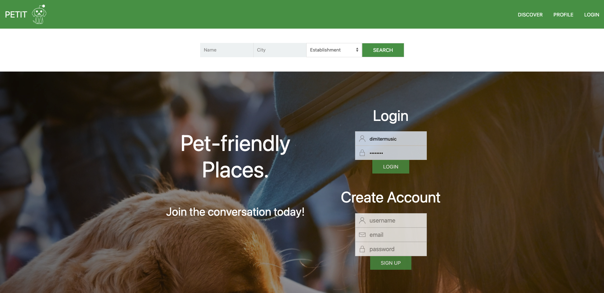
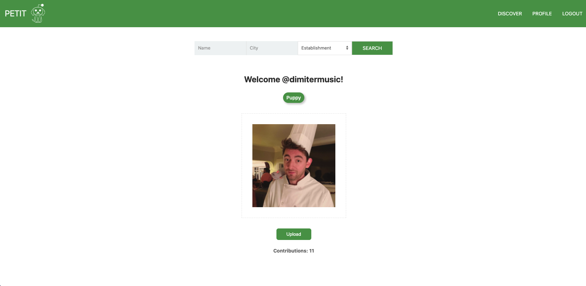
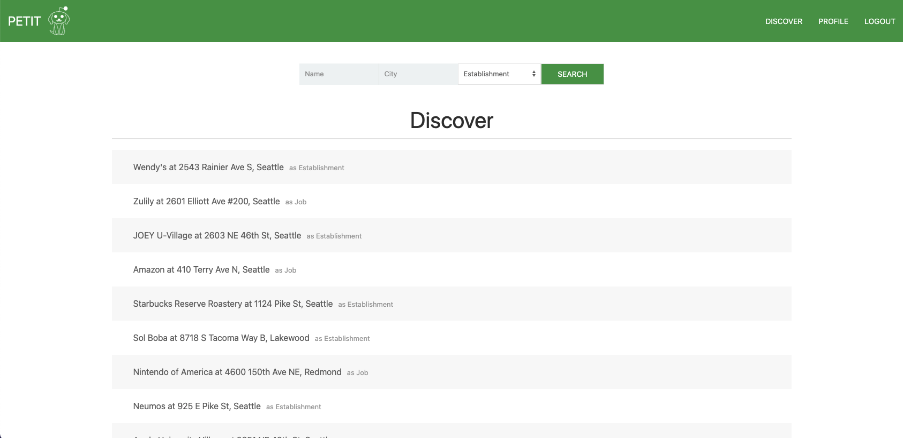
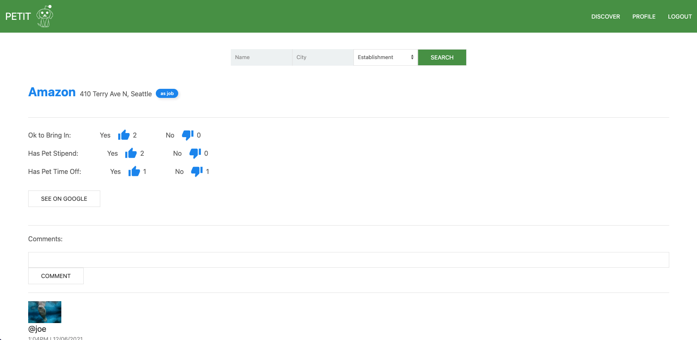
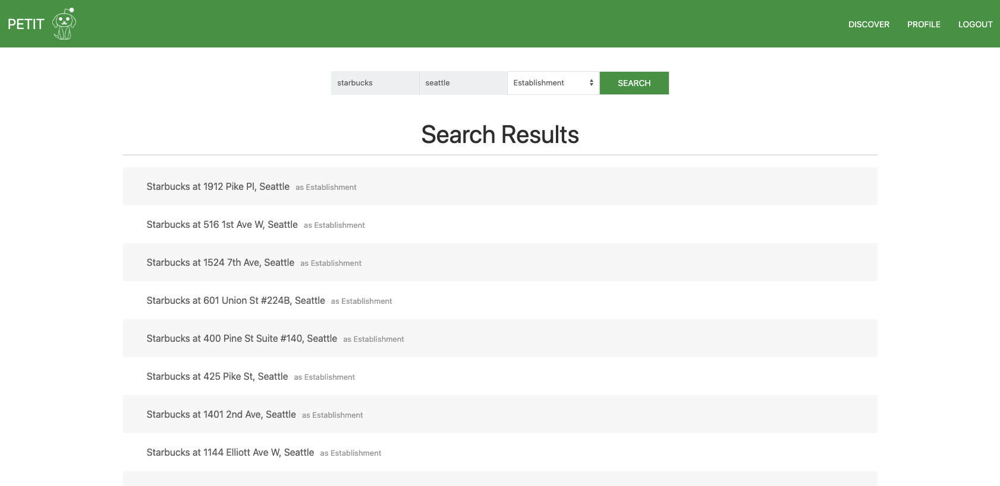
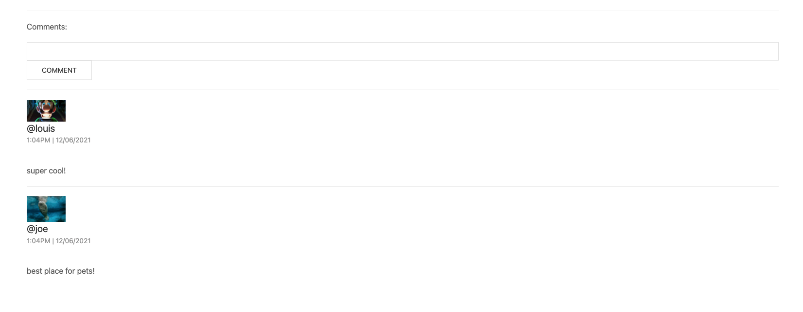
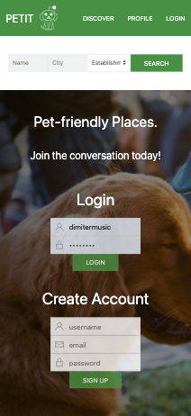

# Petit 

## Description
Full Stack social networking app allowing users to inform each other on the pet-friendliness of employers and establishments using MySQL, React, Node, and Express.

## Table of Contents
  - [Description](#description)
  - [Table of Contents](#table-of-contents)
  - [Installation](#installation)
  - [Usage](#usage)
  - [Contributing](#contributing)
  - [License](#license)
  - [Links](#links)
  - [Questions](#questions)
  - [Creators](#creators)

## Installation
Visit the deployed site [here!](https://petit-petfriendly.herokuapp.com/)

## Usage
Home/Splash page with quick tag line and call to action.  
  
Profile page with username, editable profile photo, and the amount of votes contributed to places.  
  
Discover page with preseeded places as well as recent search results.  
  
Place page with name, location and type if reviewing as an establishment or job. Options to up and down vote on the pet-friendly features of a place (dynamically changing based on if reviewing as establishment or job). A button to search the place on google. A comments section below.   
  
Search for exact names of places or using keywords and exact location or keywords and view list of results to choose from.  
  
Comments section with user photo, name, date comment was created, and content of comment.
  
Website is mobile optimized.  
  

## Contributing
Feedback is always welcome!

## License
This application is covered under the MIT License

## Links

[Deployed Site](https://petit-petfriendly.herokuapp.com/)  
[Repository](https://github.com/dimitermusic/petit-frontend)

## Questions
If you have any questions, please visit my Github profile or email me using the links below

[Github](https://github.com/dimitermusic)  
[Email](mailto:dimiteryyordanov@gmail.com)  

## Creators

Created by [Dimiter Yordanov](https://github.com/dimitermusic), [Charlotte Hulseman](https://github.com/charlottehulseman), [Kellie Kumasaka](https://github.com/kelliekumasaka), and [Jonathan Newman](https://github.com/specsnstats)